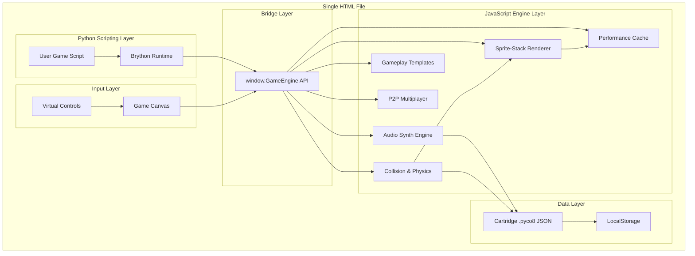
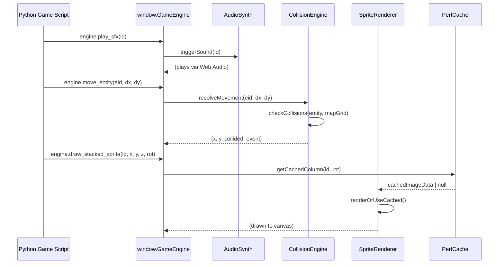
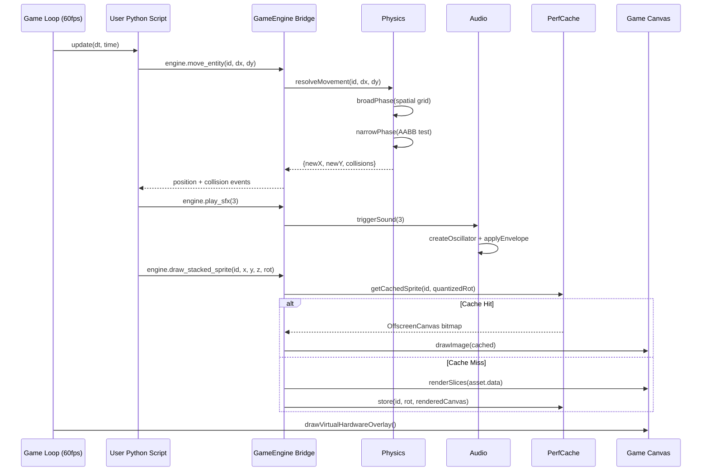

# Design Document: PYCO-8 Platform Expansion

## Overview

The PYCO-8 Platform Expansion transforms the existing fantasy console from a sprite-stacking development tool into a complete game-making powerhouse capable of producing PS1/N64/SNES-style experiences. This expansion adds four core subsystems—audio synthesis, collision physics, performance optimization, and gameplay templates—plus a stretch-goal peer-to-peer multiplayer layer, all while preserving the single-file HTML architecture and mobile-first design philosophy.

The design integrates each new subsystem through the established `window.GameEngine` bridge pattern, ensuring Python game scripts access new capabilities via the same clean API surface that currently handles rendering and input. All state persists within the `.pyco8` cartridge JSON format, keeping the "everything in one file" rapid-creation workflow intact.

The intentional graphical constraints (sprite-stacking aesthetic with layered voxel slices) remain unchanged. The expansion focuses on runtime capabilities—sound, physics, performance, and game logic—that make sprite-stacked worlds feel like living, interactive classic 3D-era games.

## Architecture

### System Overview



### Subsystem Integration Flow



## Components and Interfaces

### Component 1: Audio Synthesis Engine

**Purpose**: Provides retro chiptune sound generation using Web Audio API oscillators, a pattern-based music tracker, and SFX trigger system—all without external audio files.

**Interface**:
```javascript
// AudioSynth - Internal Engine Component
class AudioSynth {
    constructor(audioContext) {}
    
    // SFX Management
    defineSfx(id, waveform, frequency, duration, envelope) {}
    playSfx(id, volume) {}
    stopSfx(id) {}
    
    // Music Tracker
    definePattern(patternId, channels, tempo, noteData) {}
    playPattern(patternId, loop) {}
    stopMusic() {}
    setMasterVolume(vol) {}
    
    // Serialization
    exportToCartridge() {}      // Returns JSON-safe audio data
    importFromCartridge(data) {} // Loads audio definitions
}
```

**Responsibilities**:
- Generate waveforms (square, triangle, sawtooth, noise, pulse) via OscillatorNode
- Manage ADSR envelopes for each sound effect
- Sequence multi-channel tracker patterns (4 channels like classic chiptune)
- Handle Web Audio API lifecycle (resume on user gesture, context state)
- Serialize all sound definitions into cartridge JSON

### Component 2: Collision & Physics Engine

**Purpose**: Provides spatial collision detection, wall boundaries from solid map tiles, entity-vs-entity overlap testing, and event triggers (doors, chests, zone transitions).

**Interface**:
```javascript
// CollisionEngine - Internal Engine Component
class CollisionEngine {
    constructor(mapGrid, tileSize) {}
    
    // Entity Registration
    registerEntity(id, x, y, width, height, isSolid) {}
    removeEntity(id) {}
    updateEntityPosition(id, x, y) {}
    
    // Collision Detection
    resolveMovement(entityId, dx, dy) {}  // Returns {newX, newY, collisions[]}
    checkOverlap(entityId, targetId) {}   // Point-distance or AABB
    raycast(x, y, angle, maxDist) {}      // For line-of-sight
    
    // Map Tile Queries
    getTileAt(worldX, worldY, layer) {}
    isSolid(tileX, tileY) {}
    
    // Event Triggers
    registerTrigger(id, x, y, width, height, eventType, payload) {}
    checkTriggers(entityId) {}  // Returns triggered events[]
    
    // Serialization
    exportToCartridge() {}
    importFromCartridge(data) {}
}
```

**Responsibilities**:
- AABB (Axis-Aligned Bounding Box) collision for entity-vs-map-tile
- Distance-vector collision for entity-vs-entity (circular hitboxes)
- Slide-along-wall resolution (don't stop dead, slide parallel)
- Event trigger zones with configurable payloads
- Spatial grid optimization for broad-phase detection
- Integration with map editor's SOLID OBJECT layer

### Component 3: Performance Cache System

**Purpose**: Pre-renders and caches static sprite-stack columns to eliminate redundant per-frame slice iteration, maintaining smooth framerates on mobile even with dense maps.

**Interface**:
```javascript
// PerfCache - Internal Engine Component
class PerfCache {
    constructor(maxCacheSize) {}
    
    // Cache Management
    getCachedSprite(assetId, rotation, scale) {}  // Returns OffscreenCanvas | null
    cacheSprite(assetId, rotation, scale, canvas) {}
    invalidateAsset(assetId) {}
    invalidateAll() {}
    
    // Static Map Cache
    cacheMapRegion(regionKey, imageData) {}
    getMapRegion(regionKey) {}
    
    // Metrics
    getCacheStats() {}  // {hits, misses, size, maxSize}
    
    // Configuration
    setMaxSize(bytes) {}
    setRotationBuckets(count) {}  // Quantize rotation angles
}
```

**Responsibilities**:
- Cache fully-rendered sprite columns as OffscreenCanvas bitmaps
- Quantize rotation angles into buckets (e.g., 16 or 32 discrete angles)
- LRU eviction when cache exceeds memory budget
- Pre-render static map tiles that don't rotate with camera
- Track hit/miss ratios for adaptive cache sizing
- Invalidate on asset edit (hot-reload from sprite editor)

### Component 4: Gameplay Logic & Templates

**Purpose**: Provides reusable game systems (screen transitions, combat, procedural loading) as engine-level primitives accessible from Python scripts.

**Interface**:
```javascript
// GameplayTemplates - Internal Engine Component
class GameplayTemplates {
    constructor(engine) {}
    
    // Screen Transitions
    startTransition(type, duration, callback) {}  // fade, wipe, iris
    isTransitioning() {}
    
    // Scene/Screen Management
    registerScreen(id, enterFn, updateFn, exitFn) {}
    switchScreen(id, transitionType) {}
    getCurrentScreen() {}
    
    // Combat System Primitives
    createCombatEntity(id, hp, attack, defense) {}
    calculateDamage(attackerId, defenderId) {}
    applyDamage(entityId, amount) {}
    
    // Procedural Helpers
    generateDungeon(width, height, seed) {}
    spawnEntitiesInRegion(templateId, count, region) {}
    
    // Timer/Event System
    setTimer(id, duration, callback, repeat) {}
    clearTimer(id) {}
}
```

**Responsibilities**:
- Provide smooth screen-to-screen transitions (fade, wipe, iris-close)
- Manage game state machines (title → gameplay → combat → pause)
- Offer basic RPG combat math primitives
- Supply procedural dungeon/room generation algorithms
- Handle timed events and delayed callbacks
- Package as reusable templates users can activate selectively

### Component 5: Peer-to-Peer Multiplayer (Stretch Goal)

**Purpose**: Enables players to share game worlds via WebRTC data channels, with an optional free discovery server for finding nearby players.

**Interface**:
```javascript
// P2PMultiplayer - Internal Engine Component
class P2PMultiplayer {
    constructor(signalingServerUrl) {}
    
    // Connection Management
    hostSession(roomCode) {}
    joinSession(roomCode) {}
    disconnect() {}
    getConnectedPeers() {}
    
    // Data Sync
    broadcastState(entityId, stateObj) {}
    onPeerState(callback) {}        // Receive other player states
    sendMessage(peerId, type, data) {}
    onMessage(type, callback) {}
    
    // Discovery (Stretch)
    registerPlayer(username, metadata) {}
    findNearbyPlayers(radius) {}
    
    // Latency
    getPing(peerId) {}
    getNetworkStats() {}
}
```

**Responsibilities**:
- Establish WebRTC peer connections via signaling server
- Synchronize player positions/states across peers
- Handle connection/disconnection gracefully
- Provide lobby/room-code system for manual connections
- Optional: GPS-based player discovery for MMO-like feel

## Data Models

### Model 1: Extended Cartridge Format (.pyco8 v2.0)

```javascript
// Extended cartridge schema - backward compatible with v1.2
const CartridgeV2 = {
    cartVersion: "2.0.0",
    filename: "string",
    code: "string",           // Python source code
    palette: ["#hex", ...],   // Color palette array
    assets: [{                // Sprite-stack assets
        id: "number",
        name: "string",
        size: "number",       // Grid dimension (8 or 16)
        data: "[[[number]]]"  // [layer][row][col] = paletteIndex
    }],
    map: {
        ground: "[[number]]",  // [row][col] = assetId | -1
        object: "[[number]]"   // [row][col] = assetId | -1
    },
    // NEW: Audio data
    audio: {
        sfx: [{
            id: "number",
            name: "string",
            waveform: "square|triangle|sawtooth|noise|pulse",
            frequency: "number",
            duration: "number",
            envelope: { attack: 0.01, decay: 0.1, sustain: 0.5, release: 0.2 },
            pitchSlide: "number",      // Hz per second
            vibratoSpeed: "number",
            vibratoDepth: "number"
        }],
        patterns: [{
            id: "number",
            name: "string",
            tempo: "number",           // BPM
            channels: "number",        // 1-4
            noteData: [[[note, duration, volume, sfxId]]]  // [channel][step][noteEvent]
        }]
    },
    // NEW: Collision/trigger metadata
    physics: {
        entityDefs: [{
            id: "number",
            width: "number",
            height: "number",
            isSolid: "boolean"
        }],
        triggers: [{
            id: "number",
            x: "number", y: "number",
            width: "number", height: "number",
            eventType: "string",
            payload: "object"
        }]
    },
    // NEW: Gameplay template configuration
    gameplay: {
        screens: ["string"],           // Registered screen IDs
        combatEntities: [{
            id: "string",
            hp: "number",
            attack: "number",
            defense: "number"
        }],
        timers: []
    }
}
```

**Validation Rules**:
- `cartVersion` must be semver format, >= "2.0.0" for new features
- All `sfx[].id` values must be unique integers >= 0
- `sfx[].waveform` must be one of: square, triangle, sawtooth, noise, pulse
- `sfx[].envelope` values must be in range [0.0, 5.0] seconds
- `patterns[].tempo` must be in range [30, 300] BPM
- `patterns[].channels` must be 1-4
- `triggers[].eventType` must be one of: door, chest, zone, custom
- Backward compatibility: v1.2 carts load without audio/physics/gameplay keys

### Model 2: Audio Note Event

```javascript
const NoteEvent = {
    note: "number",       // MIDI note number (0-127) or -1 for rest
    duration: "number",   // Steps (1 = sixteenth note at current tempo)
    volume: "number",     // 0.0 - 1.0
    sfxId: "number"       // Reference to sfx definition for waveform
}
```

**Validation Rules**:
- `note` must be -1 (rest) or integer in [0, 127]
- `duration` must be positive integer
- `volume` must be in [0.0, 1.0]
- `sfxId` must reference an existing sfx definition

### Model 3: Collision Entity

```javascript
const CollisionEntity = {
    id: "string|number",
    x: "number",
    y: "number",
    z: "number",
    width: "number",      // Hitbox width in world units
    height: "number",     // Hitbox height in world units
    isSolid: "boolean",   // Can other entities pass through?
    velocity: { dx: 0, dy: 0 },
    onCollide: "function|null",  // Callback when hit
    triggerEvents: ["string"]    // Event types this entity emits
}
```

**Validation Rules**:
- `width` and `height` must be positive numbers
- `x`, `y`, `z` must be finite numbers
- `id` must be unique across all registered entities

## Main Algorithm/Workflow



## Algorithmic Pseudocode

### Algorithm 1: Collision Resolution with Wall Sliding

```javascript
/**
 * Resolves entity movement against map tiles and other entities.
 * Uses separate X/Y axis resolution for wall-sliding behavior.
 */
function resolveMovement(entityId, dx, dy) {
    const entity = entities.get(entityId);
    if (!entity) return { newX: 0, newY: 0, collisions: [] };
    
    const collisions = [];
    let newX = entity.x;
    let newY = entity.y;
    
    // Step 1: Resolve X-axis independently
    const testX = entity.x + dx;
    const xBox = { x: testX, y: entity.y, w: entity.width, h: entity.height };
    
    if (!collidesWithMap(xBox) && !collidesWithEntities(xBox, entityId)) {
        newX = testX;
    } else {
        collisions.push({ axis: 'x', blocked: true });
        // Snap to tile edge
        newX = dx > 0 
            ? Math.floor((testX + entity.width) / tileSize) * tileSize - entity.width
            : Math.ceil(testX / tileSize) * tileSize;
    }
    
    // Step 2: Resolve Y-axis independently
    const testY = entity.y + dy;
    const yBox = { x: newX, y: testY, w: entity.width, h: entity.height };
    
    if (!collidesWithMap(yBox) && !collidesWithEntities(yBox, entityId)) {
        newY = testY;
    } else {
        collisions.push({ axis: 'y', blocked: true });
        newY = dy > 0
            ? Math.floor((testY + entity.height) / tileSize) * tileSize - entity.height
            : Math.ceil(testY / tileSize) * tileSize;
    }
    
    // Step 3: Update entity and check triggers
    entity.x = newX;
    entity.y = newY;
    const triggeredEvents = checkTriggerZones(entity);
    
    return { newX, newY, collisions, events: triggeredEvents };
}
```

**Preconditions:**
- `entityId` references a registered entity in the entities map
- `dx`, `dy` are finite numbers representing frame-scaled movement delta
- Map grid (`mapGrid.object`) is populated with valid tile IDs

**Postconditions:**
- Entity position is updated to resolved (non-colliding) coordinates
- Returned `newX`, `newY` never place entity inside a solid tile
- Wall-sliding preserves movement along the non-blocked axis
- All trigger zones overlapping final position are reported in `events`

**Loop Invariants:** N/A (no loops in this function; map query is O(1) grid lookup)

### Algorithm 2: Audio Synthesis - SFX Trigger

```javascript
/**
 * Creates and plays a chiptune sound effect using Web Audio API.
 * Supports ADSR envelope, pitch slide, and vibrato modulation.
 */
function triggerSound(sfxId, volume = 1.0) {
    const sfx = sfxDefinitions.get(sfxId);
    if (!sfx || !audioContext) return;
    
    // Resume AudioContext on first user interaction (mobile requirement)
    if (audioContext.state === 'suspended') {
        audioContext.resume();
    }
    
    const now = audioContext.currentTime;
    
    // Create oscillator with specified waveform
    const osc = audioContext.createOscillator();
    osc.type = sfx.waveform;  // square, triangle, sawtooth, noise
    osc.frequency.setValueAtTime(sfx.frequency, now);
    
    // Apply pitch slide if defined
    if (sfx.pitchSlide !== 0) {
        const endFreq = sfx.frequency + (sfx.pitchSlide * sfx.duration);
        osc.frequency.linearRampToValueAtTime(
            Math.max(20, endFreq), now + sfx.duration
        );
    }
    
    // Apply vibrato LFO
    if (sfx.vibratoDepth > 0) {
        const lfo = audioContext.createOscillator();
        const lfoGain = audioContext.createGain();
        lfo.frequency.value = sfx.vibratoSpeed;
        lfoGain.gain.value = sfx.vibratoDepth;
        lfo.connect(lfoGain);
        lfoGain.connect(osc.frequency);
        lfo.start(now);
        lfo.stop(now + sfx.duration);
    }
    
    // ADSR Envelope
    const env = audioContext.createGain();
    const { attack, decay, sustain, release } = sfx.envelope;
    env.gain.setValueAtTime(0, now);
    env.gain.linearRampToValueAtTime(volume, now + attack);
    env.gain.linearRampToValueAtTime(volume * sustain, now + attack + decay);
    env.gain.setValueAtTime(volume * sustain, now + sfx.duration - release);
    env.gain.linearRampToValueAtTime(0, now + sfx.duration);
    
    // Connect graph: osc -> envelope -> master -> destination
    osc.connect(env);
    env.connect(masterGain);
    
    osc.start(now);
    osc.stop(now + sfx.duration + 0.01);
}
```

**Preconditions:**
- `sfxId` references a valid sfx definition in the sfxDefinitions map
- `audioContext` is initialized (created on first user gesture)
- `volume` is in range [0.0, 1.0]
- `sfx.envelope` has valid ADSR values (all >= 0, attack+decay+release <= duration)

**Postconditions:**
- An oscillator node is created, plays for `sfx.duration` seconds, then self-destructs
- ADSR envelope shapes the volume over time (no clicks/pops)
- Pitch slides smoothly if `pitchSlide` is non-zero
- No audio nodes leak (all stop and disconnect after duration)

**Loop Invariants:** N/A (event-driven, not iterative)

### Algorithm 3: Sprite Cache with LRU Eviction

```javascript
/**
 * Manages a fixed-size cache of pre-rendered sprite columns.
 * Uses rotation quantization and LRU eviction strategy.
 */
const ROTATION_BUCKETS = 32;  // 360° / 32 = 11.25° per bucket
const MAX_CACHE_ENTRIES = 128;

function getCachedSprite(assetId, rotation, scale) {
    // Quantize rotation to nearest bucket
    const bucket = Math.round(
        ((rotation % (Math.PI * 2)) + Math.PI * 2) % (Math.PI * 2) 
        / (Math.PI * 2) * ROTATION_BUCKETS
    ) % ROTATION_BUCKETS;
    
    const key = `${assetId}_${bucket}_${scale.toFixed(1)}`;
    
    if (cache.has(key)) {
        // Move to front of LRU list
        lruList.delete(key);
        lruList.add(key);
        cacheStats.hits++;
        return cache.get(key);
    }
    
    cacheStats.misses++;
    return null;
}

function cacheSprite(assetId, rotation, scale, renderedCanvas) {
    const bucket = Math.round(
        ((rotation % (Math.PI * 2)) + Math.PI * 2) % (Math.PI * 2)
        / (Math.PI * 2) * ROTATION_BUCKETS
    ) % ROTATION_BUCKETS;
    
    const key = `${assetId}_${bucket}_${scale.toFixed(1)}`;
    
    // Evict LRU entries if at capacity
    while (cache.size >= MAX_CACHE_ENTRIES) {
        const oldest = lruList.values().next().value;
        lruList.delete(oldest);
        cache.delete(oldest);
        cacheStats.evictions++;
    }
    
    cache.set(key, renderedCanvas);
    lruList.add(key);
}
```

**Preconditions:**
- `assetId` is a valid integer referencing an asset in assetLibrary
- `rotation` is a finite number (radians)
- `scale` is a positive number
- `renderedCanvas` is a valid OffscreenCanvas or Canvas element

**Postconditions:**
- `getCachedSprite` returns cached canvas or null (never throws)
- Cache size never exceeds `MAX_CACHE_ENTRIES`
- LRU ordering correctly reflects access recency
- Quantized rotation maps identical visual angles to the same bucket

**Loop Invariants:**
- While evicting: `cache.size` decreases by 1 per iteration
- After eviction loop: `cache.size < MAX_CACHE_ENTRIES`

### Algorithm 4: Music Pattern Sequencer

```javascript
/**
 * Steps through a multi-channel pattern at the defined BPM.
 * Called from the main game loop to advance note positions.
 */
function updateSequencer(dt) {
    if (!activePattern || !isPlaying) return;
    
    const stepDuration = 60.0 / (activePattern.tempo * 4);  // 16th note duration
    sequencerAccumulator += dt;
    
    while (sequencerAccumulator >= stepDuration) {
        sequencerAccumulator -= stepDuration;
        
        // Process each channel at current step
        for (let ch = 0; ch < activePattern.channels; ch++) {
            const noteEvent = activePattern.noteData[ch][currentStep];
            
            if (noteEvent && noteEvent.note >= 0) {
                // Calculate frequency from MIDI note
                const freq = 440 * Math.pow(2, (noteEvent.note - 69) / 12);
                
                // Trigger using referenced SFX waveform/envelope
                triggerTrackerNote(ch, freq, noteEvent.duration * stepDuration, 
                                   noteEvent.volume, noteEvent.sfxId);
            }
        }
        
        // Advance step counter
        currentStep++;
        if (currentStep >= activePattern.noteData[0].length) {
            if (loopPattern) {
                currentStep = 0;
            } else {
                isPlaying = false;
                currentStep = 0;
            }
        }
    }
}
```

**Preconditions:**
- `activePattern` is a valid pattern object with noteData, tempo, channels
- `dt` is positive frame delta time in seconds
- `activePattern.noteData[ch]` has equal length across all channels
- All `sfxId` references in noteData point to valid sfx definitions

**Postconditions:**
- Sequencer advances exactly one step per `stepDuration` seconds
- All channels at current step are triggered simultaneously
- Pattern loops or stops based on `loopPattern` flag
- No timing drift (accumulator absorbs frame time variance)

**Loop Invariants:**
- `sequencerAccumulator` decreases toward 0 with each step processed
- `currentStep` is always in range [0, pattern.length)
- After the while loop: `sequencerAccumulator < stepDuration`

### Algorithm 5: Map Tile Collision Query

```javascript
/**
 * Checks if a bounding box overlaps any solid tiles in the map grid.
 * Uses the OBJECT layer of mapGrid where tiles represent solid obstacles.
 */
function collidesWithMap(box) {
    // Convert world coordinates to tile grid coordinates
    const startCol = Math.floor(box.x / tileSize);
    const endCol = Math.floor((box.x + box.w) / tileSize);
    const startRow = Math.floor(box.y / tileSize);
    const endRow = Math.floor((box.y + box.h) / tileSize);
    
    // Check all tiles that the box could overlap
    for (let row = startRow; row <= endRow; row++) {
        for (let col = startCol; col <= endCol; col++) {
            // Bounds check
            if (row < 0 || row >= mapHeight || col < 0 || col >= mapWidth) {
                return true;  // Out-of-bounds is treated as solid (world boundary)
            }
            
            // Check OBJECT layer for solid tiles
            const tileId = mapGrid.object[row][col];
            if (tileId !== -1) {
                return true;  // Any non-empty object tile is solid
            }
        }
    }
    
    return false;
}
```

**Preconditions:**
- `box` has properties {x, y, w, h} as positive finite numbers
- `mapGrid.object` is a 2D array of size [mapHeight][mapWidth]
- `tileSize` is a positive integer (world units per tile)

**Postconditions:**
- Returns `true` if any solid tile overlaps the bounding box
- Returns `true` for out-of-bounds coordinates (world boundary walls)
- Returns `false` only if all overlapped tiles are empty (-1)

**Loop Invariants:**
- All tiles at indices < current (row, col) have been checked and are empty
- If a solid tile is found, function returns immediately (early exit)

## Key Functions with Formal Specifications (Python API Surface)

These are the new functions exposed to Python game scripts via the `window.GameEngine` bridge.

### Function: engine.play_sfx(id, volume=1.0)

```python
# Python API - plays a defined sound effect
engine.play_sfx(3)              # Play SFX #3 at full volume
engine.play_sfx(0, 0.5)        # Play SFX #0 at half volume
```

**Preconditions:**
- `id` is a non-negative integer referencing a defined SFX
- `volume` is a float in range [0.0, 1.0], defaults to 1.0
- Audio context has been initialized (happens on first user interaction)

**Postconditions:**
- Sound begins playing immediately (within 1 audio frame ~2.9ms)
- Sound auto-stops after its defined duration
- Returns nothing (fire-and-forget)
- If `id` is invalid, call is silently ignored (no error thrown)

### Function: engine.play_music(pattern_id, loop=True)

```python
# Python API - starts a music pattern
engine.play_music(0)            # Play pattern 0, looping
engine.play_music(1, False)     # Play pattern 1, once
```

**Preconditions:**
- `pattern_id` references a defined pattern in the cartridge
- `loop` is boolean

**Postconditions:**
- Music begins from step 0 of the pattern
- Any previously playing music is stopped first
- Sequencer advances automatically each frame via updateSequencer(dt)

### Function: engine.stop_music()

```python
engine.stop_music()
```

**Preconditions:** None (safe to call even if no music playing)
**Postconditions:** Music sequencer stops, current step resets to 0

### Function: engine.move_entity(entity_id, dx, dy)

```python
# Python API - moves entity with collision resolution
result = engine.move_entity("player", jx * speed * dt, jy * speed * dt)
# result = {"x": 125.3, "y": 80.1, "collisions": [...], "events": [...]}
```

**Preconditions:**
- `entity_id` is a string/number referencing a registered entity
- `dx`, `dy` are numeric movement deltas (typically speed * dt scaled)

**Postconditions:**
- Entity position updated to valid (non-colliding) location
- Returns object with: final x/y, collision list, triggered events
- Wall-sliding behavior: movement continues along unblocked axis
- If entity_id is unregistered, returns {x:0, y:0, collisions:[], events:[]}

### Function: engine.register_entity(id, x, y, w, h, solid=True)

```python
# Register player with 12x12 hitbox
engine.register_entity("player", 120, 120, 12, 12, True)
# Register a non-blocking NPC
engine.register_entity("npc_01", 64, 64, 10, 10, False)
```

**Preconditions:**
- `id` is unique (not already registered)
- `x`, `y` are valid world coordinates
- `w`, `h` are positive numbers (hitbox dimensions)

**Postconditions:**
- Entity added to collision engine's spatial index
- Entity participates in collision detection from next frame onward
- Duplicate `id` overwrites previous registration

### Function: engine.register_trigger(id, x, y, w, h, event_type, payload)

```python
# Door trigger zone
engine.register_trigger("door_1", 100, 50, 20, 20, "door", {"target": "dungeon_2"})
# Loot chest
engine.register_trigger("chest_3", 200, 180, 16, 16, "chest", {"item": "key", "qty": 1})
```

**Preconditions:**
- `id` is unique trigger identifier
- `x, y, w, h` define a rectangular zone in world coordinates
- `event_type` is a string ("door", "chest", "zone", "custom")
- `payload` is a JSON-serializable dictionary

**Postconditions:**
- Trigger zone registered; fires when any entity overlaps it
- Events delivered via `engine.move_entity()` return value
- Trigger persists until explicitly removed or cart reload

### Function: engine.check_overlap(id_a, id_b)

```python
# Check if player touches an enemy
if engine.check_overlap("player", "enemy_01"):
    start_combat()
```

**Preconditions:**
- Both `id_a` and `id_b` are registered entities

**Postconditions:**
- Returns boolean: True if bounding boxes/circles overlap
- Does not modify entity positions
- Returns False if either entity ID is invalid

### Function: engine.transition(type, duration, callback_name)

```python
# Fade to black over 0.5s, then call 'load_next_room'
engine.transition("fade", 0.5, "load_next_room")
```

**Preconditions:**
- `type` is one of: "fade", "wipe_left", "wipe_right", "iris_close", "iris_open"
- `duration` is positive number (seconds)
- `callback_name` is a string naming a Python function defined in user code

**Postconditions:**
- Transition animation renders over game canvas for `duration` seconds
- `engine.is_transitioning()` returns True during animation
- Named callback is invoked after transition completes
- Game loop continues running during transition (update still called)

### Function: engine.set_master_volume(vol)

```python
engine.set_master_volume(0.7)  # 70% volume
```

**Preconditions:** `vol` is a float in [0.0, 1.0]
**Postconditions:** All audio output scaled by this value immediately

## Example Usage

### Example 1: Complete Game with Audio, Collisions, and Transitions

```python
from browser import window
import math

engine = window.GameEngine

# Register entities
engine.register_entity("player", 120, 120, 12, 12, True)
engine.register_entity("enemy_01", 200, 80, 10, 10, True)

# Register trigger zones
engine.register_trigger("door_1", 50, 50, 20, 20, "door", {"target_screen": "dungeon"})
engine.register_trigger("chest_1", 180, 200, 16, 16, "chest", {"item": "potion"})

# Player state
player = {"speed": 90.0, "hp": 100, "asset_id": 0, "angle": 0.0}
current_screen = "overworld"

def update(dt, time):
    global current_screen
    
    if engine.is_transitioning():
        return  # Let transition render, skip logic
    
    engine.clear_screen("#0f0f14")
    
    # Read input
    jx = engine.get_joy_x()
    jy = engine.get_joy_y()
    
    # Move with collision detection
    if abs(jx) > 0.15 or abs(jy) > 0.15:
        result = engine.move_entity("player", jx * player["speed"] * dt, 
                                               jy * player["speed"] * dt)
        player["angle"] = math.atan2(jy, jx) + math.pi / 2
        
        # Handle trigger events
        for event in result.get("events", []):
            if event["type"] == "door":
                engine.play_sfx(1)  # Door open sound
                engine.transition("fade", 0.4, "load_dungeon")
            elif event["type"] == "chest":
                engine.play_sfx(2)  # Chest open jingle
                add_item(event["payload"]["item"])
    
    # Combat check
    if engine.check_overlap("player", "enemy_01"):
        engine.play_sfx(3)  # Hit sound
        engine.transition("iris_close", 0.3, "start_combat")
    
    # A button: attack
    if engine.is_btn_pressed("A"):
        engine.play_sfx(0)  # Sword swing
        engine.play_rumble(20)
    
    # Draw world and entities
    engine.draw_world_map()
    engine.draw_stacked_sprite(player["asset_id"], result["x"], result["y"], 0, player["angle"])
    engine.draw_stacked_sprite(1, 200, 80, 0, time * 0.5)  # Spinning enemy

def load_dungeon():
    global current_screen
    current_screen = "dungeon"
    engine.play_music(1, True)  # Dungeon BGM

def start_combat():
    engine.stop_music()
    engine.play_music(2, True)  # Battle BGM

# Start background music
engine.play_music(0, True)  # Overworld theme
engine.set_master_volume(0.8)
engine.set_loop(update)
```

### Example 2: Defining Audio in the SFX Editor (Engine-Side)

```javascript
// These would be created via a future SFX Editor tab or loaded from cartridge
audioSynth.defineSfx(0, {
    name: "Sword Swing",
    waveform: "noise",
    frequency: 800,
    duration: 0.12,
    envelope: { attack: 0.005, decay: 0.05, sustain: 0.2, release: 0.05 },
    pitchSlide: -2000,
    vibratoSpeed: 0,
    vibratoDepth: 0
});

audioSynth.defineSfx(1, {
    name: "Door Open",
    waveform: "square",
    frequency: 220,
    duration: 0.3,
    envelope: { attack: 0.01, decay: 0.1, sustain: 0.4, release: 0.15 },
    pitchSlide: 400,
    vibratoSpeed: 0,
    vibratoDepth: 0
});

audioSynth.defineSfx(2, {
    name: "Chest Jingle",
    waveform: "triangle",
    frequency: 440,
    duration: 0.5,
    envelope: { attack: 0.01, decay: 0.15, sustain: 0.6, release: 0.2 },
    pitchSlide: 200,
    vibratoSpeed: 8,
    vibratoDepth: 15
});
```

### Example 3: Performance Cache Integration (Transparent to User)

```javascript
// Modified renderPerspectiveCameraStackedSprite with cache layer
function renderPerspectiveCameraStackedSprite(ctx, id, worldX, worldY, worldZ, angle, isRuntime, cW, cH) {
    if (isRuntime && perfCache) {
        const cached = perfCache.getCachedSprite(id, angle, currentScale);
        if (cached) {
            // Draw cached bitmap directly (fast path)
            const drawPos = calculateScreenPosition(worldX, worldY, worldZ);
            ctx.drawImage(cached, drawPos.x - cached.width/2, drawPos.y - cached.height/2);
            return;
        }
    }
    
    // Slow path: render all slices (existing code)
    const rendered = renderSlicesToOffscreen(id, angle, currentScale);
    
    if (isRuntime && perfCache) {
        perfCache.cacheSprite(id, angle, currentScale, rendered);
    }
    
    const drawPos = calculateScreenPosition(worldX, worldY, worldZ);
    ctx.drawImage(rendered, drawPos.x - rendered.width/2, drawPos.y - rendered.height/2);
}
```

## Correctness Properties

*A property is a characteristic or behavior that should hold true across all valid executions of a system—essentially, a formal statement about what the system should do. Properties serve as the bridge between human-readable specifications and machine-verifiable correctness guarantees.*

### Property 1: No Audio Leak

*For any* SFX triggered with any valid duration, the oscillator node SHALL disconnect from the audio graph within `duration + 0.01` seconds. No audio nodes remain connected after their scheduled stop time.

**Validates: Requirements 1.2**

### Property 2: Volume Bounded

*For any* combination of master volume, SFX volume, and ADSR envelope parameters, all gain node values in the audio system remain in the range [0.0, 1.0]. Envelope gain never exceeds unity or goes negative.

**Validates: Requirements 1.7, 3.2, 3.3**

### Property 3: Sequencer Timing Accuracy

*For any* pattern played at tempo T with any sequence of frame delta times, the number of steps advanced after elapsed time t equals `floor(t * T * 4 / 60)`. The accumulator-based approach absorbs frame time variance without drift.

**Validates: Requirements 2.3**

### Property 4: Idempotent Music Stop

*For any* sequencer state (playing, stopped, never started), calling `stop_music()` produces no side effects, does not throw, and leaves the sequencer in a consistent stopped state with step counter at 0.

**Validates: Requirements 2.6**

### Property 5: No Solid Tile Penetration

*For any* entity at any position with any movement vector of any magnitude, after `resolveMovement()` completes, the entity bounding box does not overlap any solid tile in `mapGrid.object`.

**Validates: Requirements 4.6**

### Property 6: Wall Slide Preservation

*For any* entity and movement vector where only one axis (X or Y) is blocked by a solid tile, movement along the unblocked axis is fully preserved. The entity slides along walls rather than stopping dead.

**Validates: Requirements 4.1, 4.2**

### Property 7: Boundary Containment

*For any* entity after movement resolution, `0 ≤ entity.x` and `entity.x + entity.width ≤ mapWidth * tileSize`, and equivalently for Y. Out-of-bounds movement is blocked as if the world boundary is a solid wall.

**Validates: Requirements 4.4**

### Property 8: Trigger Determinism

*For any* trigger zone and entity trajectory, entering the zone fires the associated event exactly once per entry. Continuous movement within the zone does not re-fire. Exiting and re-entering fires again.

**Validates: Requirements 6.2, 6.3, 6.4**

### Property 9: Overlap Symmetry

*For any* two registered entities at any positions, `check_overlap(a, b) === check_overlap(b, a)`. Collision detection is commutative.

**Validates: Requirements 5.4**

### Property 10: Cache Key Determinism

*For any* asset ID, rotation angle, and scale, the generated cache key is always identical across calls. Quantized rotation maps the same visual angle to the same bucket deterministically.

**Validates: Requirements 7.4, 7.5**

### Property 11: LRU Size Invariant

*For any* sequence of `cacheSprite()` calls, the cache size never exceeds `MAX_CACHE_ENTRIES`. After any insertion, `cache.size <= MAX_CACHE_ENTRIES`.

**Validates: Requirements 8.1**

### Property 12: LRU Eviction Correctness

*For any* sequence of cache accesses and insertions, when the cache is at capacity, the evicted entry is always the one with the oldest access timestamp (least recently used).

**Validates: Requirements 8.2**

### Property 13: Cache Invalidation Safety

*For any* asset ID, after `invalidateAsset(id)` is called, no subsequent `getCachedSprite(id, ...)` returns data. All entries for that asset are removed from both the cache map and LRU list.

**Validates: Requirements 8.3**

### Property 14: Cartridge Round-Trip Fidelity

*For any* valid cartridge object, `deserialize(serialize(cartridge))` produces a value equivalent to the original. No data loss occurs on save/load cycles for any cartridge field.

**Validates: Requirements 11.4**

### Property 15: Backward Compatibility

*For any* valid v1.2 cartridge file (without audio/physics/gameplay keys), loading into the v2.0 engine succeeds without error. Missing subsystem keys default to empty arrays/objects.

**Validates: Requirements 11.2**

### Property 16: Subsystem Isolation

*For any* cartridge with one corrupted or missing subsystem section, all other sections load independently and correctly. Corrupted audio data does not prevent map, code, or asset loading.

**Validates: Requirements 11.5**

### Property 17: Cartridge Validation Correctness

*For any* generated cartridge data, the validator accepts data that meets all constraints (unique SFX IDs, valid waveforms, envelope values in [0.0, 5.0], tempos in [30, 300], channels 1–4) and rejects data that violates any constraint.

**Validates: Requirements 11.3**

### Property 18: Damage Calculation Bounds

*For any* attacker attack stat and defender defense stat (both non-negative integers), `calculate_damage()` returns `max(1, attack - defense)`. Damage is always at least 1 and HP after `apply_damage()` is always at least 0.

**Validates: Requirements 12.2, 12.3**

### Property 19: Dungeon Generation Determinism

*For any* seed, width, and height values, calling `generate_dungeon()` twice with the same parameters produces an identical grid layout.

**Validates: Requirements 13.2**

### Property 20: Entity Spawn Containment

*For any* region bounds and entity count, all entities placed by `spawn_entities_in_region()` have positions within the specified region boundaries.

**Validates: Requirements 13.3**

### Property 21: Single Active Pattern

*For any* sequence of `play_music()` calls, at most one pattern is active at any time. A new `play_music()` call stops the previous pattern before starting the new one.

**Validates: Requirements 2.2**

## Error Handling

### Error Scenario 1: AudioContext Suspended (Mobile Autoplay Policy)

**Condition**: Browser blocks audio playback until first user interaction (touch/click)
**Response**: AudioContext.resume() called on first `play_sfx()` or `play_music()` invocation; sounds queued silently until context resumes
**Recovery**: Once resumed, all subsequent audio calls work immediately; no user-visible error

### Error Scenario 2: Invalid SFX/Pattern ID

**Condition**: Python script references an SFX or pattern ID that doesn't exist in the cartridge
**Response**: Call is silently ignored (no error thrown to Python layer); console.warn for developers
**Recovery**: No recovery needed; game continues running. Dev can check browser console.

### Error Scenario 3: Entity Registration Overflow

**Condition**: Game registers more entities than the spatial grid can efficiently handle (>256)
**Response**: Warning logged; oldest non-player entities evicted from collision system
**Recovery**: Automatic; evicted entities stop participating in collision but remain renderable

### Error Scenario 4: Cache Memory Pressure

**Condition**: OffscreenCanvas cache approaches device memory limits on low-end mobile
**Response**: Reduce MAX_CACHE_ENTRIES dynamically based on measured frame times; if FPS drops below 30, halve cache size
**Recovery**: LRU eviction frees memory; performance degrades gracefully to uncached rendering

### Error Scenario 5: Cartridge Version Mismatch

**Condition**: Loading a v2.0 cartridge with audio/physics data into the engine
**Response**: Missing subsystem keys default to empty arrays/objects; presence of unknown keys is ignored
**Recovery**: Engine runs with whatever data is present; missing subsystems simply have no defined assets

### Error Scenario 6: WebRTC Connection Failure (Multiplayer Stretch)

**Condition**: Peer connection fails due to NAT, firewall, or signaling server unavailability
**Response**: Connection attempt times out after 10 seconds; error callback invoked with reason
**Recovery**: Game continues in single-player mode; user can retry connection manually

## Testing Strategy

### Unit Testing Approach

**Key Test Cases**:
- Collision resolution: entity vs single tile, entity vs corner, entity vs map boundary
- Audio synthesis: oscillator creation, ADSR envelope timing, pitch slide calculation
- Cache system: hit/miss behavior, LRU eviction order, invalidation correctness
- Cartridge serialization: round-trip tests for all new data models
- Sequencer timing: step advancement at various BPM values

**Coverage Goals**: 90%+ for collision math, audio parameter validation, cache key generation

### Property-Based Testing Approach

**Property Test Library**: fast-check (JavaScript)

**Key Properties to Test**:
1. Collision resolution never places entities inside solid tiles (random entity positions + random movement vectors)
2. Cache key generation is deterministic (same inputs always produce same key)
3. ADSR envelope values never go negative or exceed 1.0 (random envelope parameters)
4. Sequencer step count equals expected count after N seconds (random tempos, random durations)
5. Cartridge round-trip: serialize → deserialize → serialize produces identical output

### Integration Testing Approach

**End-to-End Scenarios**:
- Full game loop: input → movement → collision → event trigger → audio playback → render
- Cartridge lifecycle: create game → save → reload → verify all systems restore correctly
- Hot-reload: edit sprite in editor → verify cache invalidation → verify correct render
- Mobile lifecycle: backgrounding/foregrounding → verify audio context resumes

## Performance Considerations

### Target Performance
- 60 FPS on mid-range mobile (2020+ devices)
- 30 FPS minimum on low-end devices
- Audio latency < 20ms from trigger to audible output

### Optimization Strategy
1. **Sprite Cache**: Pre-render rotated sprite columns into OffscreenCanvas bitmaps; 32 rotation buckets covers 11.25° resolution (imperceptible to player)
2. **Static Map Regions**: Cache map tiles that don't change between frames as a single composite image
3. **Spatial Hashing**: Divide collision world into grid cells; only check entities in same/adjacent cells
4. **Lazy Audio Init**: Don't create AudioContext until first sound is requested
5. **Frame Budget**: If frame takes > 16ms, skip cache warming and use direct render

### Memory Budget
- Sprite cache: ~8MB (128 entries × 64KB average OffscreenCanvas)
- Audio buffers: ~1MB (synthesized on-the-fly, no stored PCM)
- Collision grid: ~64KB (spatial hash for 256 entities over 16x16 map)
- Total expansion overhead: <10MB additional memory

## Security Considerations

### Single-File Architecture
- No external network requests required for core features
- All game data stored in LocalStorage (same-origin policy protects it)
- Brython sandbox limits Python code to browser APIs only
- No eval() of user input outside Brython's controlled environment

### Multiplayer (Stretch Goal)
- WebRTC data channels are encrypted by default (DTLS)
- Signaling server only relays connection offers (no game data passes through server)
- Rate limiting on peer messages to prevent flooding
- No authentication of game state (trust model: casual play, not competitive)
- Room codes use cryptographically random values to prevent guessing

### Cartridge Import
- JSON.parse with try/catch prevents malformed cartridge crashes
- Schema validation on import rejects unexpected data types
- No executable code in cartridge format (code is treated as text, re-parsed by Brython on play)

## Dependencies

### Required (All Already Available - No New External Dependencies)
- **Brython 3.11.0** - Python-in-browser runtime (already loaded via CDN)
- **Web Audio API** - Built into all modern browsers (no library needed)
- **Canvas 2D API** - Already in use for rendering
- **OffscreenCanvas API** - Available in all modern browsers for cache bitmaps
- **LocalStorage API** - Already in use for cartridge persistence

### Stretch Goal Dependencies
- **WebRTC API** - Built into browsers (no library needed)
- **Signaling Server** - Minimal WebSocket server (Node.js, ~50 lines) for peer discovery
- **Geolocation API** - For "nearby players" discovery (browser built-in)

### Development Dependencies
- **fast-check** - Property-based testing (dev only, not shipped)
- **No build tools** - Single HTML file architecture means no bundler/transpiler needed
